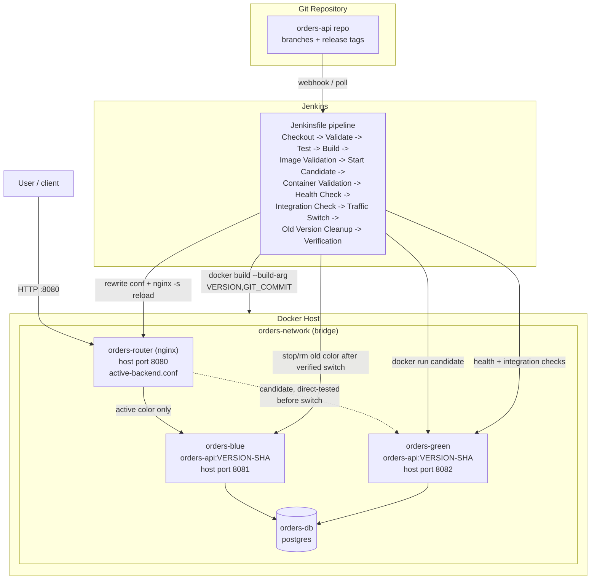

# Final Architecture

## Notes

- **orders-router** is the only container that ever binds host port 8080.
  It is what makes the switch atomic from the user's point of view: the
  candidate is fully tested on its own port (8081/8082) before the router
  is ever pointed at it.
- **Only one of blue/green is "active"** at a time; the inactive slot is
  either idle (nothing running) or holds a candidate under test.
- **orders-db** is shared by both colors and is never restarted as part of
  a deployment — this matches the incident's observation that "the database
  container is still running" throughout.
- Version identity flows one direction only: **Git commit → image label →
  container env → `/version` HTTP response → deployment manifest**, so any
  running container can always be traced back to the exact commit that
  produced it (Phase 4).
